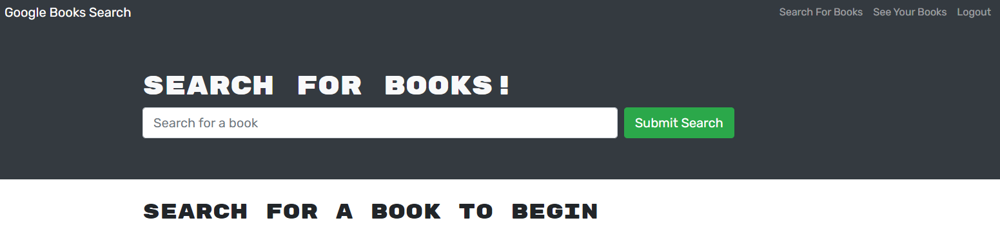

# My Book Finder

## Website

[](https://tranquil-taiga-26286.herokuapp.com/)

https://tranquil-taiga-26286.herokuapp.com/

## Description

My Book Finder gives the user an opportunity to save their favorite books to reference later. Using the [Google Books API](https://developers.google.com/books), one simply searches for their book's title and is presented with multiple options based on that query. By signing into the application, the user can then save any of these results to their own personal collection.

## Installation (for local use)

1. Fork the main branch from [GitHub](https://github.com/mimi5930/my-book-finder)

2. In the root directory, install dependencies

```
npm install
```

3. Run the back-end and REACT servers using the command

```
npm run develop
```

## Questions

Please contact me at mikej.miller440@gmail.com or via [GitHub](https://github.com/mimi5930) with any questions
